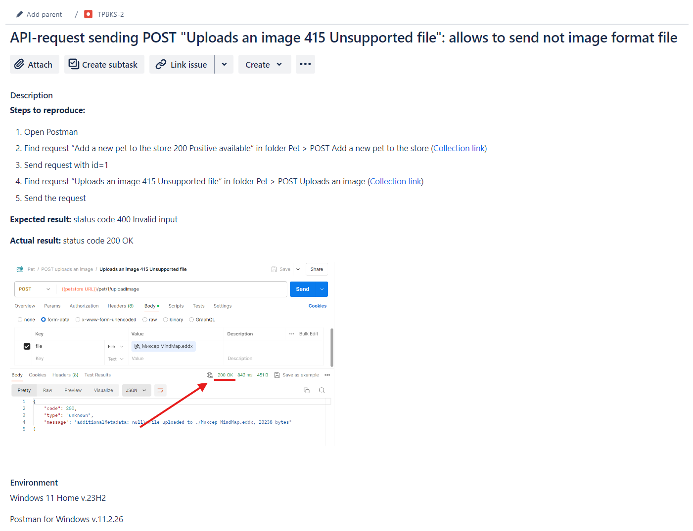
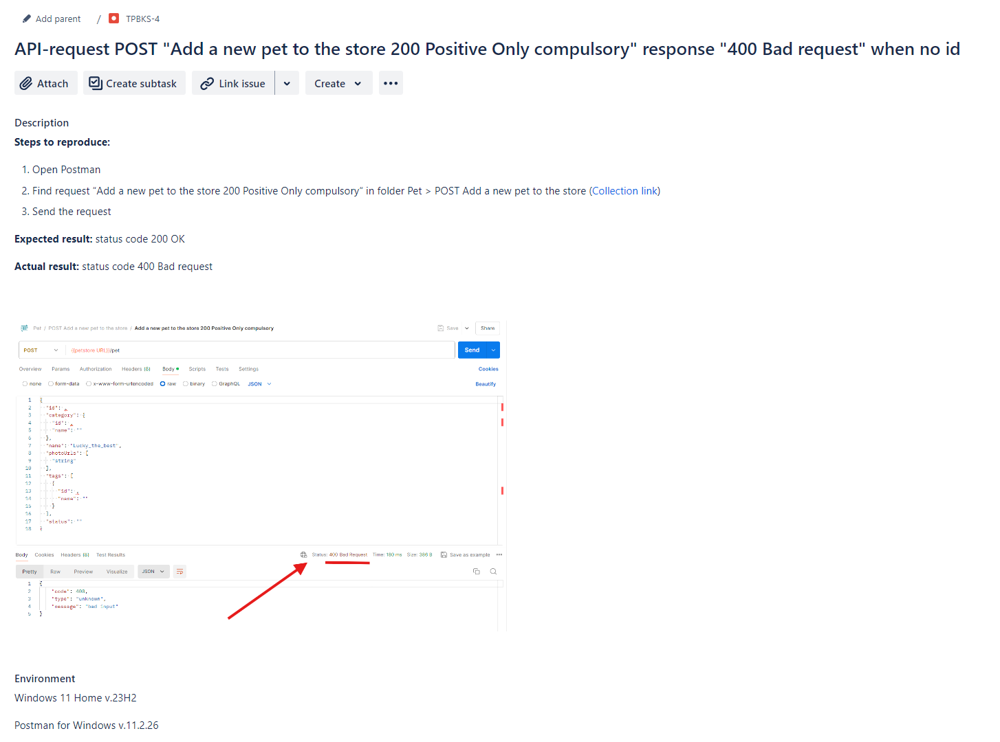

During my studying I tested API of PetStore ([Documentation link](https://petstore.swagger.io)). I found some bugs and made bug-reports. 
 
 
 

# 📝 *Documentation defects*
 

 

 

 

 

 

# 🐞 *Bug-reports*
 

 

 

 

 

 

 

 

 

 

 

 

 

 

 

 

 

 

 

 

 

 

 

 
